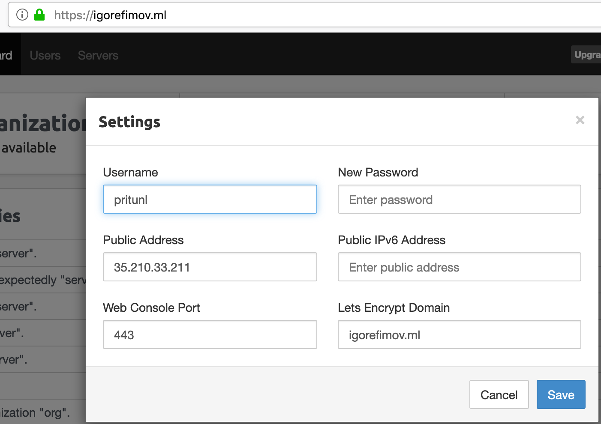

# igefimov_infra :czech_republic:

igefimov Infra repository
## Homework 1
* Integrated personal Slack channel #igor_efimov with Travis CI 
* Fixed python test
* Add PR template 

## Homework 2
* Signed up for a free GCP account
* Uploaded public ssh key to the platform 
* Spinned up 2 VM(one with public + internal IP and one with internal IP only) in the europe-west1-d zone:
```bash
bastion_IP = 35.210.33.211
someinternalhost_IP = 10.132.0.5

```

###### Independent task :bangbang:
Come up with one liner for  ssh connection to the someinternalhost through the bastion from my local machine.

**Solution 1:**
```bash 
ssh-add /Users/efimovi/Otus/DevOps_course/.ssh/gcp
ssh -t -A gcp@35.210.33.211 ssh 10.132.0.5
ssh -A -J gcp@35.210.33.211 gcp@10.132.0.5
```

**Solution 2:**
```bash 
ssh-add /Users/efimovi/Otus/DevOps_course/.ssh/gcp
ssh -A -J gcp@35.210.33.211 gcp@10.132.0.5
```
**Problems:**
Sometimes ssh connection is hanging. Restart VM from GCP UI in order to fix it.

###### Extra task :star: :star: :star:
Come up with ssh alias in order to connect to the someinternalhost through the bastion from my local machine

**Solution**
```bash
tee -a ~/.ssh/config << END
Host bastion
  HostName 35.210.33.211
  User gcp
  IdentityFile ~/Otus/DevOps_course/.ssh/gcp

Host someinternalhost
  HostName 10.132.0.5
  user gcp
  ProxyJump bastion

END
```

* Added few Emoji
* Added .idea to the .gitignore file
* Allow http/https traffic for bastion VM
* Installed mongodb and pritunl(VPN server) on bastion VM using setupvpn.sh
```bash
cat <<EOF> setupvpn.sh
#!/bin/bash
echo "deb http://repo.mongodb.org/apt/ubuntu xenial/mongodb-org/3.4 multiverse" > /etc/apt/sources.list.d/mongodb-org-3.4.list
echo "deb http://repo.pritunl.com/stable/apt xenial main" > /etc/apt/sources.list.d/pritunl.list
apt-key adv --keyserver hkp://keyserver.ubuntu.com --recv 0C49F3730359A14518585931BC711F9BA15703C6
apt-key adv --keyserver hkp://keyserver.ubuntu.com --recv 7568D9BB55FF9E5287D586017AE645C0CF8E292A
apt-get --assume-yes update
apt-get --assume-yes upgrade
apt-get --assume-yes install pritunl mongodb-org
systemctl start pritunl mongod
systemctl enable pritunl mongod
```

* Configured and Started VPN server on port 16290/udp
* Downloaded configuration file(cloud-bastion.ovpn) for VPN to local machine
* Installed TunnelBlick(OpenVPN client) and added configuration file from previous step
* Connected to someinternalhost using private IP thx to active VPN connection
    * credentials: test/6214157507237678334670591556762

**Problems** :sweat_smile:

Couldn't connect to VPN server: 
```bash
2019-06-20 11:32:44.201117 UDP link local: (not bound)
2019-06-20 11:32:44.201131 UDP link remote: [AF_INET]35.210.33.211:16290
```
**Solution**

Checked firewall rules and networking VM section.
Added 2 more networking tags: <VPN_hostname> <firewall_rule>
Overall there should be 4 networking tags: bastion, http-server, https-server, vpn-16290

###### Extra task :star: :star: :star:
Enable TLS encryption for VPN Server UI

**Solution**
* Register domain name igorefimov.ml and link it to bastion public IP address
* Update VPN Server setting with a new domain



